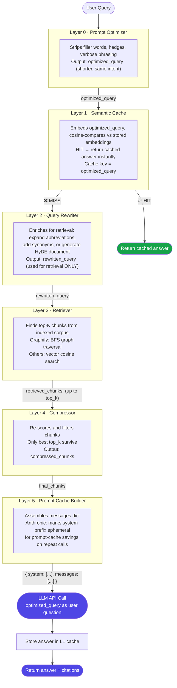
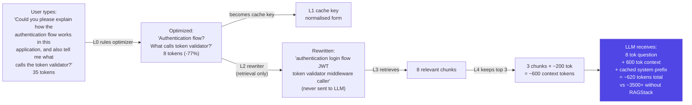
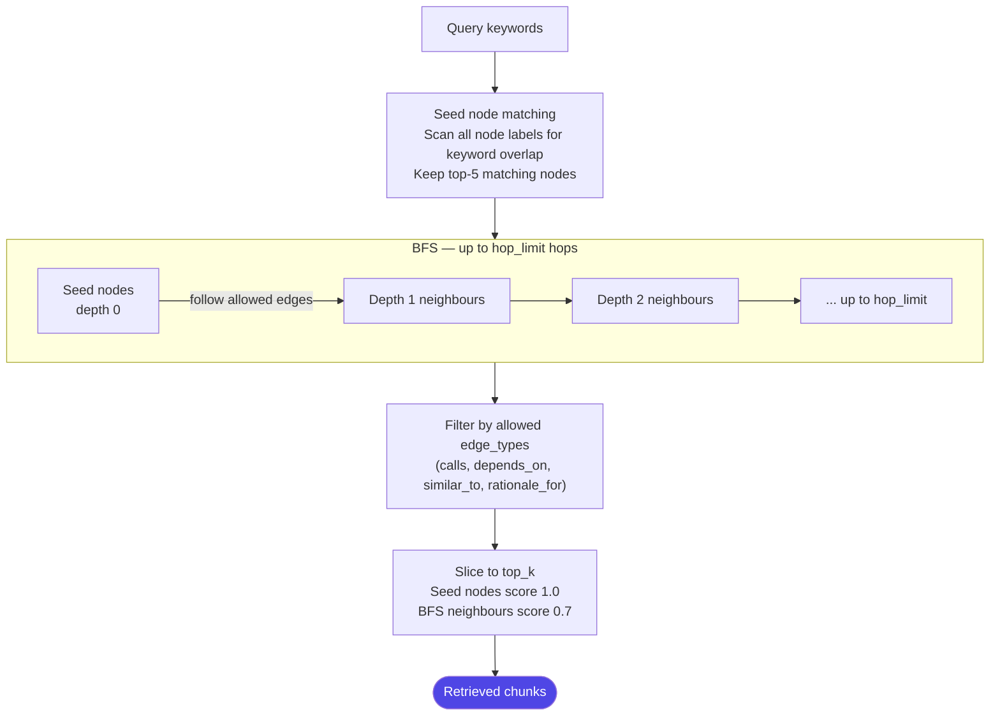
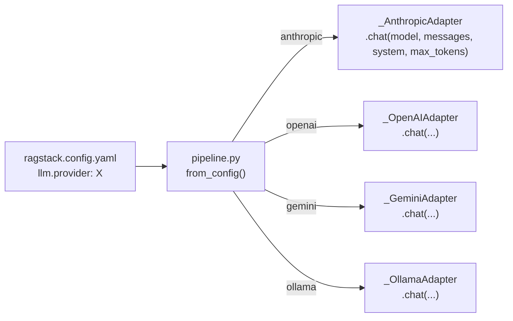
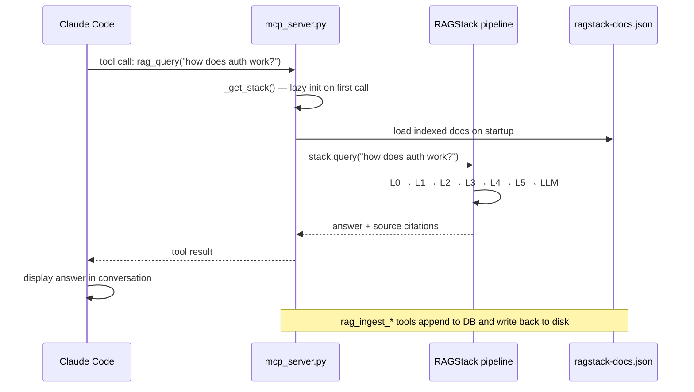
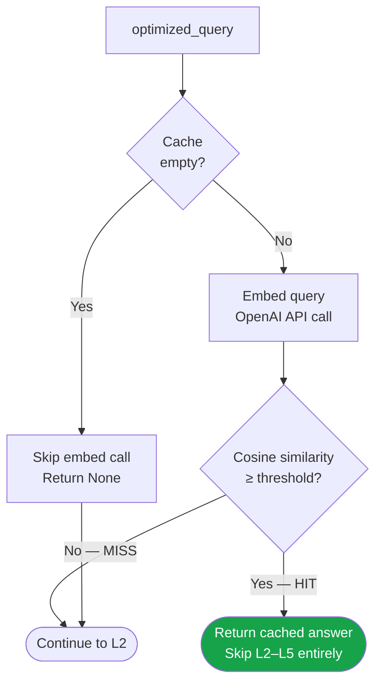

# RAGStack — Architecture

## Full Pipeline Flow



---

## QueryContext — the data object

A single `QueryContext` dataclass flows through every layer. No layer imports another layer — they all read/write `QueryContext` fields.

```python
@dataclass
class QueryContext:
    original_query:    str        # what the user typed
    optimized_query:   str = ""   # after Layer 0 (shorter)
    rewritten_query:   str = ""   # after Layer 2 (richer, for retrieval only)
    retrieved_chunks:  list[dict] # after Layer 3
    compressed_chunks: list[dict] # after Layer 4

    @property
    def cache_key(self) -> str:
        # optimized_query normalises phrasing variations → more cache hits
        return self.optimized_query or self.original_query

    @property
    def active_query(self) -> str:
        # richest form used for vector retrieval
        return self.rewritten_query or self.optimized_query or self.original_query

    @property
    def llm_query(self) -> str:
        # what the LLM sees — concise, optimized
        return self.optimized_query or self.original_query

    @property
    def final_chunks(self) -> list[dict]:
        return self.compressed_chunks or self.retrieved_chunks
```

---

## Token Savings Walkthrough



### Cumulative savings

| Source | Without RAGStack | With RAGStack |
|--------|-----------------|---------------|
| User prompt | 35 tokens | **8 tokens** (L0 −77%) |
| Context window | raw docs, unfiltered | **top 3 chunks** (L4) |
| System prefix | repeated every call | **cached** (L5 ephemeral) |
| Repeated questions | full LLM call each time | **cache hit, free** (L1) |

---

## Graphify — Graph-Based Retriever (Deep Dive)

### Why a graph?

Standard vector search finds chunks that are *textually similar* to the query. Graphify finds chunks that are *structurally connected* — callers, callees, dependencies — even if they don't share keywords.

### BFS traversal algorithm



### Graph JSON schema

```json
{
  "nodes": [
    {
      "id":      "auth/auth_service.py::AuthService",
      "label":   "AuthService",
      "type":    "class",
      "file":    "auth/auth_service.py",
      "content": "class AuthService:\n    def authenticate(self, token): ..."
    },
    {
      "id":      "auth/token_validator.py::TokenValidator",
      "label":   "TokenValidator",
      "type":    "class",
      "file":    "auth/token_validator.py",
      "content": "class TokenValidator:\n    def validate(self, jwt): ..."
    }
  ],
  "edges": [
    {
      "source":   "auth/auth_service.py::AuthService",
      "target":   "auth/token_validator.py::TokenValidator",
      "relation": "calls"
    },
    {
      "source":   "auth/token_validator.py::TokenValidator",
      "target":   "auth/auth_service.py::AuthService",
      "relation": "depends_on"
    }
  ]
}
```

### Supported edge types

| Type | Meaning |
|------|---------|
| `calls` | Function/method A calls B |
| `depends_on` | Module A imports or depends on B |
| `semantically_similar_to` | A and B are semantically related |
| `rationale_for` | A explains why B exists |

### Fallback behaviour

If no seed nodes match the query keywords, Graphify falls back to returning the `GRAPH_REPORT.md` content (first 2000 chars). Keep a human-readable architecture summary there.

---

## ABCs and registries

Every layer follows the same pattern: one ABC in `base.py`, multiple backends in `layers/<name>.py`, one registry dict at the bottom.

```
base.py                         layers/<name>.py
──────────────────────          ─────────────────────────────────────
PromptOptimizerBackend  ←──     RuleBasedOptimizerBackend
                        ←──     LLMOptimizerBackend
                        ←──     PassthroughOptimizerBackend
                                OPTIMIZER_BACKENDS = {"rules": ..., "llm": ..., ...}

CacheBackend            ←──     MemoryCacheBackend
                        ←──     RedisCacheBackend
                        ←──     QdrantCacheBackend
                                CACHE_BACKENDS = {"memory": ..., "redis": ..., ...}

RewriterBackend         ←──     LLMRewriterBackend
                        ←──     HyDERewriterBackend
                        ←──     PassthroughRewriterBackend

RetrieverBackend        ←──     GraphifyRetrieverBackend
                        ←──     MemoryRetrieverBackend
                        ←──     ChromaRetrieverBackend
                        ←──     PineconeRetrieverBackend
                        ←──     WeaviateRetrieverBackend

CompressorBackend       ←──     RerankerCompressorBackend
                        ←──     LLMLinguaCompressorBackend
                        ←──     PassthroughCompressorBackend

PromptCacheBackend      ←──     AnthropicPromptCacheBackend
                        ←──     OpenAIPromptCacheBackend
                        ←──     NoPromptCacheBackend
```

`pipeline.py` is the **only file** that imports from multiple layers. No layer file imports another layer file.

---

## LLM Provider Adapters



All adapters expose the same `.chat()` interface. The pipeline never imports a provider SDK at module level — each adapter does a lazy `import` inside `_get()`.

---

## MCP Integration



The MCP server starts lazy — `RAGStack.from_config()` only runs on the first tool call.

---

## Cache Hit vs Miss Flow



The empty-cache short-circuit means **zero embedding API calls** on a fresh pipeline (no `OPENAI_API_KEY` needed when cache is empty).

---

## Adding a New Backend — Step by Step

Example: adding a **Milvus** retriever.

### 1. Implement the class in `layers/retriever.py`

```python
class MilvusRetrieverBackend(RetrieverBackend):
    def __init__(self, embedder, uri: str, collection: str):
        from pymilvus import MilvusClient   # lazy import
        self._embedder   = embedder
        self._client     = MilvusClient(uri=uri)
        self._collection = collection

    def retrieve(self, query: str, top_k: int) -> list[dict]:
        vec = self._embedder.embed(query)
        results = self._client.search(
            collection_name=self._collection,
            data=[vec], limit=top_k,
            output_fields=["text", "source"],
        )
        return [
            {"text": r["entity"]["text"], "source": r["entity"]["source"],
             "score": r["distance"], "metadata": {}}
            for r in results[0]
        ]
```

### 2. Add one line to the registry

```python
RETRIEVER_BACKENDS["milvus"] = MilvusRetrieverBackend
```

### 3. Wire it in `pipeline.py` `from_config()`

```python
elif ret_backend_name == "milvus":
    m_cfg = ret_cfg.get("milvus", {})
    retriever = RETRIEVER_BACKENDS["milvus"](
        embedder=embedder,
        uri=m_cfg.get("uri", "http://localhost:19530"),
        collection=m_cfg.get("collection", "ragstack_docs"),
    )
```

### 4. Update `ragstack.config.yaml`

```yaml
retriever:
  backend: milvus
  milvus:
    uri: http://localhost:19530
    collection: ragstack_docs
```

### 5. Done

Every other layer, the MCP server, GUI, and slash commands work with zero additional changes. Restart Claude Code and the new backend is active.

---

## Dependency Policy

| Rule | Why |
|------|-----|
| Never import a backend SDK at module level | Zero-dep backends remain importable without optional packages |
| Never import one layer from another layer | Keeps coupling explicit and testable in isolation |
| All config values come from YAML | No hardcoded model names, URLs, or thresholds |
| Passthrough / memory backends always available | Any stack runs with zero external services |
