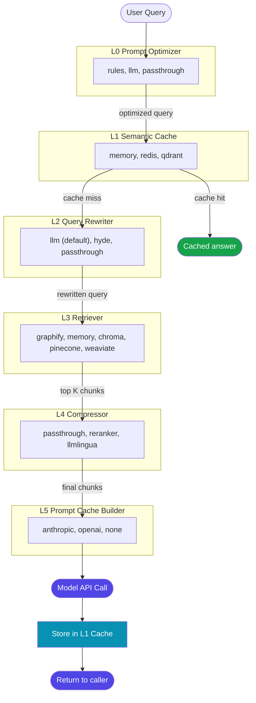
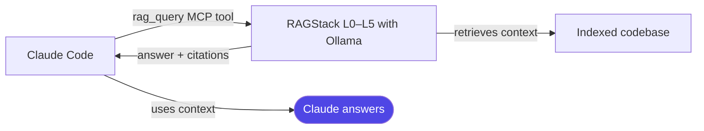

# RAGStack

<p align="center">
  <strong>Token-optimized RAG pipeline for Claude Code</strong><br>
  6 swappable layers · Free local LLM via Ollama · One-click presets with auto-install · MCP + GUI + CLI
</p>

<p align="center">
  
  
  
  
</p>

---

## What is RAGStack?

RAGStack sits between your codebase and the LLM. Every query passes through up to **6 independent layers** that reduce token usage, skip redundant LLM calls, and surface the most relevant context — all configurable from a YAML file or the GUI with no code changes.

```
User Query → [L0 Optimizer] → [L1 Cache] → [L2 Rewriter] → [L3 Retriever] → [L4 Compressor] → [L5 Prompt Cache] → LLM
                                    ↓ cache hit
                               Instant free answer
```

> **Works completely free.** Use the Ollama preset — local LLM, local embeddings, no API key, no cost.

---

## ⚡ Quick Start

### Prerequisites

- Python 3.10+
- [Ollama](https://ollama.com) for free local models **or** an Anthropic / OpenAI / Gemini API key

---

### Step 1 — Install RAGStack

```bash
git clone <repo>
cd converter
python install.py
```

This single command:
- Installs all Python dependencies
- Copies `ragstack.config.yaml` to your project root
- Registers the MCP server **globally** in `~/.claude/settings.json`
- Writes slash commands to `.claude/commands/`

---

### Step 2 — Launch the GUI and pick a preset

```bash
python ragstack/gui.py
# Opens http://localhost:7860
```

Go to **Configuration → Quick Presets** and click your provider.

> **Free option:** Click **🦙 Ollama / Llama (Free)** — the GUI automatically installs the `ollama` Python package and pulls the `llama3.2` model. You only need to install the [Ollama app](https://ollama.com) first.

---

### Step 3 — Install Claude Code CLI

```bash
# Windows (PowerShell)
irm https://claude.ai/install.ps1 | iex

# macOS / Linux
curl -fsSL https://claude.ai/install.sh | sh
```

If the installer says the binary isn't on your PATH, add it (the installer will show the exact path). Then verify:

```bash
claude --version
```

---

### Step 4 — Make slash commands global (one-time)

By default, slash commands are installed into the RAGStack project folder. Run this once to make them available in **every** project:

```powershell
# Windows PowerShell
Copy-Item ".claude\commands\*.md" "$HOME\.claude\commands\" -Force
```

```bash
# macOS / Linux
cp .claude/commands/*.md ~/.claude/commands/
```

---

### Step 5 — Open Claude Code and index your project

```bash
cd /path/to/your/project
claude
```

Inside Claude Code:

```
/rag-index .                         ← index the current project
/rag-query how does auth work?       ← ask questions
/graphify .                          ← build knowledge graph (optional, for Graphify preset)
```

---

## Using RAGStack with Any Project

RAGStack is installed **once** and works across all your projects.

### What is global (works everywhere automatically)

| Thing | Where | Set up by |
|---|---|---|
| MCP tools (`rag_query`, `rag_ingest_directory`…) | `~/.claude/settings.json` | `install.py` — automatic |
| Slash commands (`/rag-query`, `/rag-index`…) | `~/.claude/commands/` | Step 4 above — copy once |
| RAGStack GUI | `http://localhost:7860` | Index any directory path from the GUI |

### What needs to be done per project

| Thing | What to do |
|---|---|
| Document index | `/rag-clear` then `/rag-index .` in each project |
| Graphify graph | `/graphify .` once per project to build `graphify-out/graph.json` |

### Switching projects workflow

```bash
cd /path/to/new-project
claude
```

Inside Claude Code:
```
/rag-clear          ← flush the previous project's chunks
/rag-index .        ← index this project
/rag-query <q>      ← ask questions about this project
```

> **Why clear first?** The memory retriever shares one index. Without clearing, old chunks from a previous project mix into answers.

---

## Quick Presets

One-click configurations in the **Configuration** tab of the GUI. Ollama-based presets **auto-install** everything they need on first click.

| Preset | LLM | Cost | Auto-installs |
|--------|-----|------|---------------|
| 🦙 **Ollama / Llama (Free)** | `llama3.2` local | **Free** | `ollama` pkg · pulls `llama3.2` · uses local embeddings |
| 🤖 **Anthropic Claude** | `claude-sonnet-4-6` | Pay per token | — set `ANTHROPIC_API_KEY` |
| 🔵 **OpenAI GPT-4o** | `gpt-4o-mini` | Pay per token | — set `OPENAI_API_KEY` |
| 🌟 **Google Gemini** | `gemini-1.5-flash` | Pay per token | — set `GOOGLE_API_KEY` |
| 🕸 **Graphify + Ollama** | `llama3.2` local | **Free** | `ollama` pkg · `llama3.2` · `graphifyy` · `graphify install` |

Install progress is shown in the **Status box** below the preset buttons.

> Presets update the LLM, rewriter, and prompt-cache settings. Your retriever backend, compressor, and cache threshold are preserved.

---

## Pipeline Architecture



### The 6 Layers

| Layer | Role | Backends |
|-------|------|---------|
| **L0** Optimizer | Strips filler words, compresses query (−15–77% tokens) | `rules` · `llm` · `passthrough` |
| **L1** Cache | Semantic hit → skip L2–L5, free instant answer | `memory` · `redis` · `qdrant` |
| **L2** Rewriter | Expands query with synonyms for better retrieval — **uses Ollama by default, free** | `llm` · `hyde` · `passthrough` |
| **L3** Retriever | Finds top-K relevant chunks from indexed corpus | `graphify` · `memory` · `chroma` · `pinecone` · `weaviate` |
| **L4** Compressor | Reranks and filters chunks, keeps only top-K | `passthrough` · `reranker` · `llmlingua` |
| **L5** Prompt Cache | Assembles final messages, caches system prefix | `anthropic` · `openai` · `none` |

> **L2 tip:** The rewritten query is only used for retrieval — it never reaches the final LLM. When using Ollama, L2 costs nothing (local call) and significantly improves recall by expanding keywords before graph/TF-IDF search.

---

## Graphify — Graph-Based RAG

Graphify is the most powerful retriever for codebases. Instead of text similarity, it traverses a **code relationship graph** using BFS — finding callers, callees, and dependencies even when they don't share keywords with your query.

### Auto-setup

Click **🕸 Graphify + Ollama** in the GUI → it installs `graphifyy` and registers the Claude Code skill automatically.

Then build the graph once:

```bash
# In Claude Code, from your project root:
/graphify .
```

This generates:
- `graphify-out/graph.json` — the queryable knowledge graph
- `graphify-out/GRAPH_REPORT.md` — god nodes, surprising connections, suggested questions
- `graphify-out/graph.html` — interactive browser visualization

### Manual install

```bash
pip install graphifyy
graphify install --platform windows   # or: claude / codex / cursor / gemini
```

### When to use Graphify vs Memory

| Question type | Best retriever |
|---|---|
| "What calls X?" / "What depends on X?" | **Graphify** — follows call graph edges |
| Text / documentation questions | **Memory** or Chroma |
| No graph built yet | **Memory** — works immediately |
| Large codebase, cloud deployment | Pinecone / Weaviate |

> The retriever returns 0 chunks until `graph.json` exists. The GUI warns you if it's missing when you apply the Graphify preset.

---

## Token Savings

| Source | Without RAGStack | With RAGStack |
|--------|-----------------|---------------|
| User prompt | 35 tokens | **8 tokens** (L0 −77%) |
| Context | Full corpus, unfiltered | **Top 3 chunks** (L4) |
| System prefix | Repeated every call | **Cached** (L5) |
| Repeated questions | Full LLM call | **Cache hit — free** (L1) |

---

## MCP Tools

Registered globally in `~/.claude/settings.json` by `install.py`. Available in Claude Code from **any** project automatically.

| Tool | Description |
|------|-------------|
| `rag_query` | Run full pipeline for a question, return answer + citations |
| `rag_ingest_file` | Index a single file |
| `rag_ingest_directory` | Index a directory recursively |
| `rag_ingest_text` | Add a raw text snippet |
| `rag_status` | Return pipeline health as JSON |
| `rag_clear_cache` | Flush the semantic cache and document index |

---

## Slash Commands

Available in Claude Code after copying to `~/.claude/commands/` (Step 4).

| Command | What it does |
|---------|-------------|
| `/rag-index .` | Index current directory |
| `/rag-index src/` | Index a specific folder |
| `/rag-query <question>` | Search index and answer |
| `/rag-status` | Show backend health |
| `/rag-clear` | Flush semantic cache + index |
| `/rag-add <text>` | Add raw text to index |

---

## Using RAGStack with Claude Code / Claude Pro

**Claude Pro ≠ Anthropic API.** Claude Pro gives you claude.ai access. The Anthropic API is billed separately. But you can get powerful RAG completely free:



RAGStack acts as a **context retriever**, not an LLM replacement. Claude Code's own model does the final answering using the context RAGStack found.

### Cost breakdown

| Component | Ollama preset | Anthropic preset |
|-----------|--------------|-----------------|
| RAGStack pipeline (L0–L5) | **Free** (local) | ~$0.001/query |
| Semantic cache hit (L1) | **Free** | **Free** |
| Embeddings (L1 cache, L2 HyDE) | **Free** (Ollama local) | ~$0.0001/query (OpenAI) |
| Claude Code final answer | Covered by subscription | Covered by subscription |

---

## Pipeline Studio GUI

```bash
python ragstack/gui.py
# http://localhost:7860
```

| Tab | Purpose |
|-----|---------|
| **Pipeline Studio** | Submit queries, inspect every layer's output, full-pipeline vs inspect mode |
| **Configuration** | One-click presets (with auto-install) + backend dropdowns + YAML editor |
| **Status & Tools** | Set API keys, index any directory, clear cache |
| **Docs** | Full interactive documentation |

---

## Optional Backends

```bash
python install.py --extras redis reranker chroma
python install.py --extras ollama      # free local LLM (auto-installed by Ollama presets)
python install.py --extras gemini      # Google Gemini
```

| Extra | Package | Enables |
|-------|---------|---------|
| `ollama` | `ollama>=0.2` | Local LLM + local embeddings — **auto-installed by Ollama presets** |
| `openai` | `openai>=1.0` | OpenAI embeddings + GPT models |
| `redis` | `redis[hiredis]>=5.0` | Redis semantic cache backend |
| `qdrant` | `qdrant-client>=1.7` | Qdrant semantic cache backend |
| `reranker` | `sentence-transformers>=2.0` | CrossEncoder compressor (L4) |
| `llmlingua` | `llmlingua>=0.2` | Token compression (L4) |
| `chroma` | `chromadb>=0.4` | Chroma local vector retriever |
| `pinecone` | `pinecone-client>=3.0` | Pinecone cloud retriever |
| `weaviate` | `weaviate-client>=4.0` | Weaviate cloud retriever |
| `gemini` | `google-generativeai>=0.5` | Google Gemini LLM |

> **Graphify** (`graphifyy` on PyPI) is auto-installed when you click the 🕸 preset. Manual: `pip install graphifyy && graphify install`.

---

## Architecture

See [ARCHITECTURE.md](ARCHITECTURE.md) for the full deep-dive: QueryContext data flow, each layer's internals, LLM adapter table, embedder auto-selection logic, MCP integration diagram, and a step-by-step guide for adding new backends.
